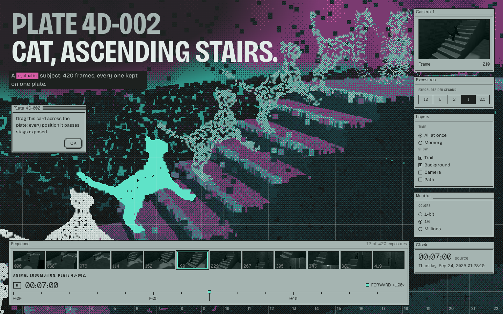
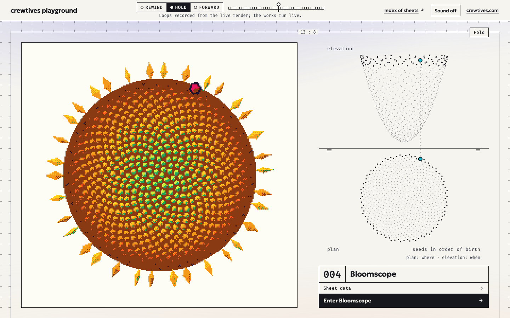
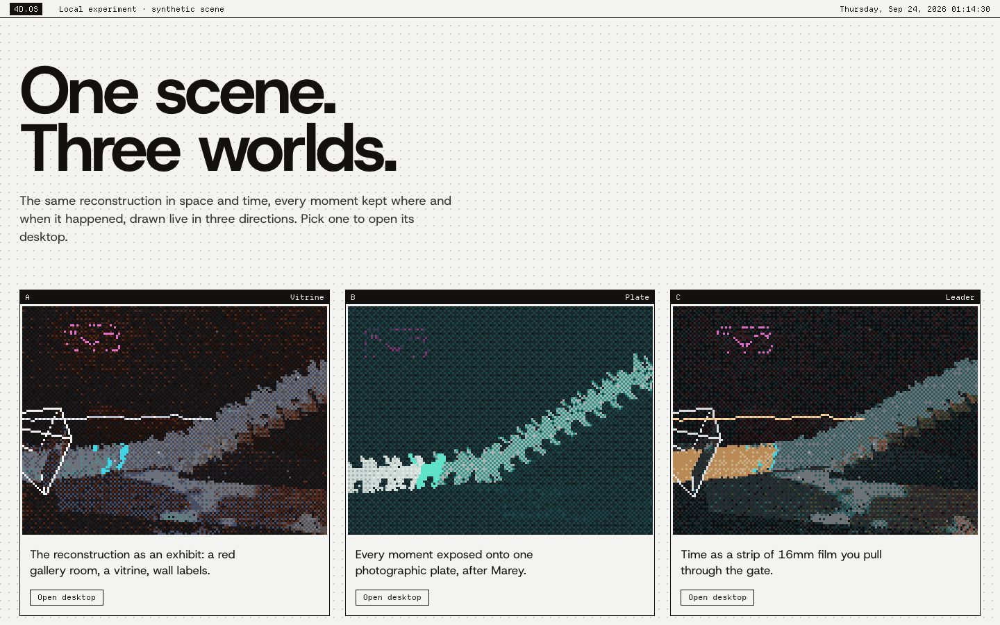
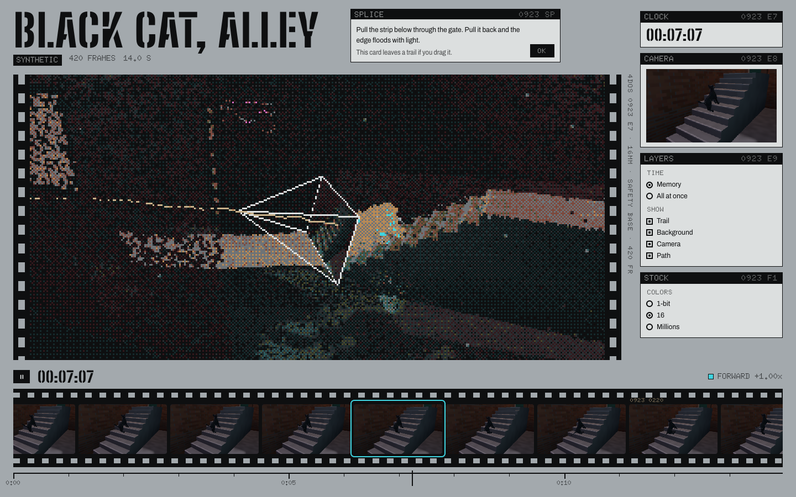
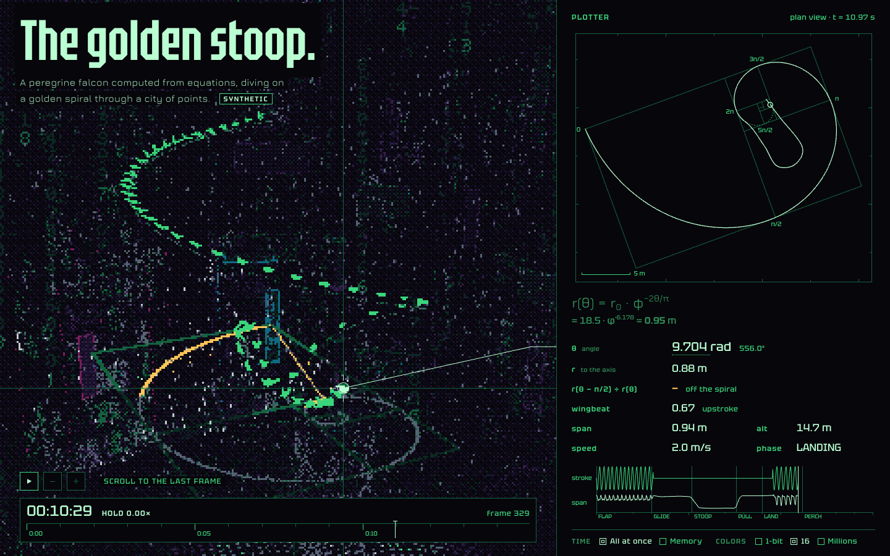
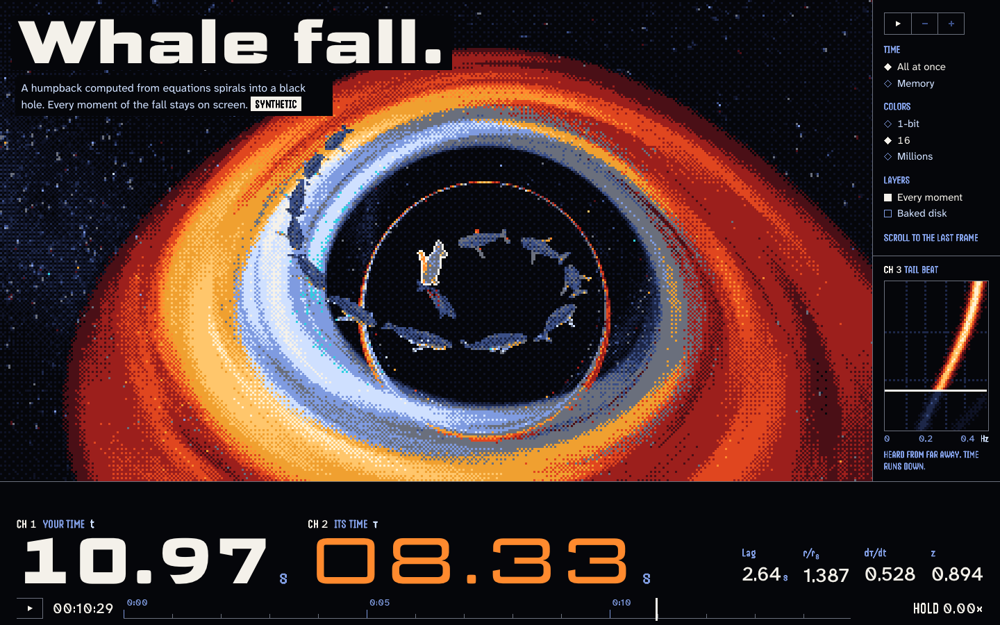
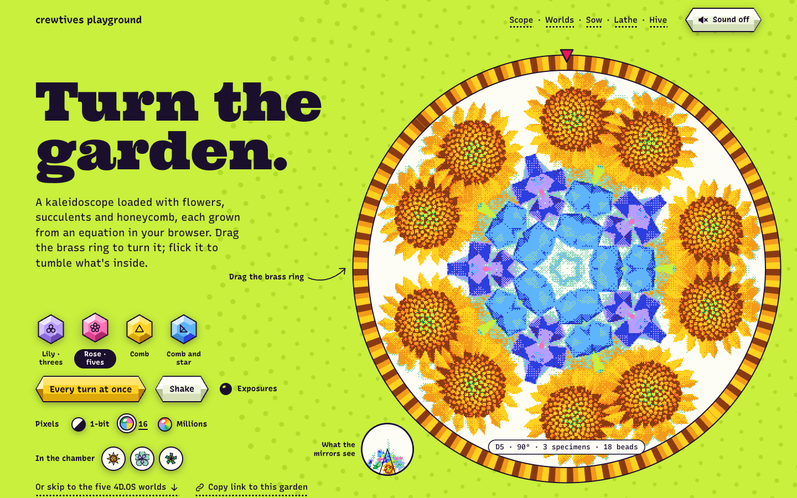
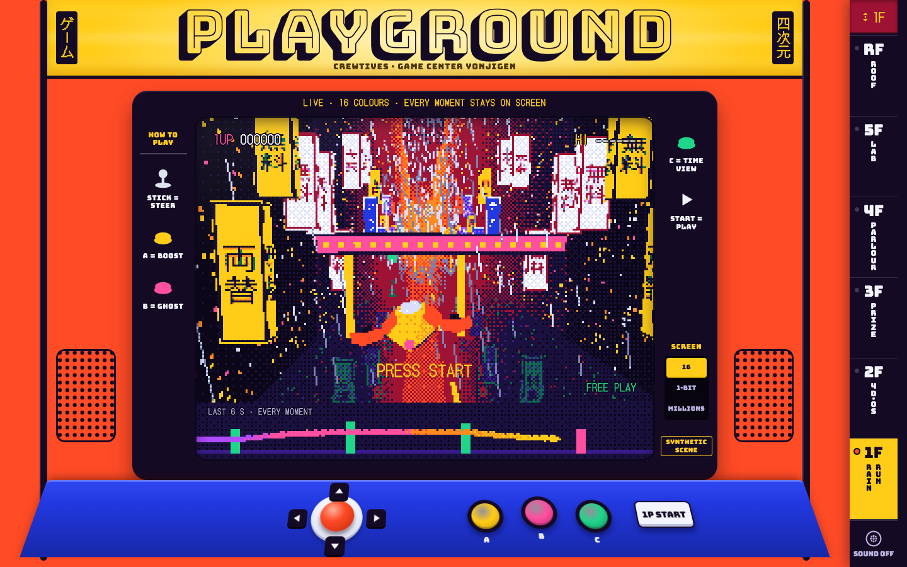
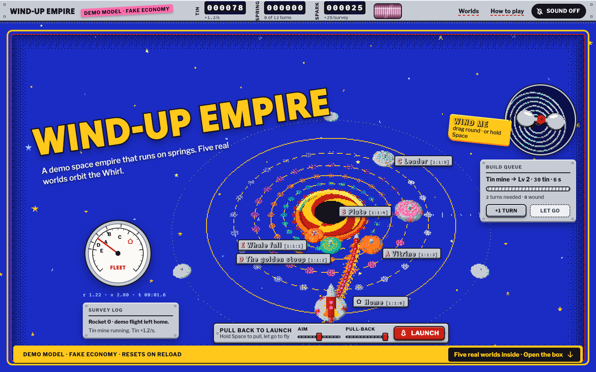

# crewtives playground

A real-time engine that shows every moment of a scene at once, five 4D.OS worlds built on it, and a
museum that exhibits them. Vanilla TypeScript and three.js, specified with OpenSpec.



*World B, Plate, captured from the engine's live render. The cat is derived from "Cat" by J-Toastie,
[CC-BY 3.0](https://creativecommons.org/licenses/by/3.0/) ([model](https://poly.pizza/m/8GJbfM8R1A)).*

## Live

Everything is published at **https://playground.crewtives.com/** as one static site.

| Page | Route | What it is |
|---|---|---|
| Museum | [`/`](https://playground.crewtives.com/) | The collection as a set of technical sheets. Each work gets a recorded loop, its trail drawn in plan and elevation, and a title block with data read from the work. |
| 4D.OS launcher | [`/4d-os/`](https://playground.crewtives.com/4d-os/) | One scene, three worlds: the same pack and the same clock, drawn live in three palettes, plus the way into worlds D and E. |
| A · Vitrine | [`/4d-os/a/`](https://playground.crewtives.com/4d-os/a/) | A red gallery room. A black cat climbs a stairway, and every step it takes stays as points. |
| B · Plate | [`/4d-os/b/`](https://playground.crewtives.com/4d-os/b/) | A chronophotographic plate under an aurora sky. The cat's whole climb, exposed at once. |
| C · Leader | [`/4d-os/c/`](https://playground.crewtives.com/4d-os/c/) | A 16 mm film leader. Scrub the strip and the night scene runs through it. |
| D · The golden stoop | [`/4d-os/d/`](https://playground.crewtives.com/4d-os/d/) | A peregrine falcon computed from equations, stooping along a golden spiral. |
| E · Whale fall | [`/4d-os/e/`](https://playground.crewtives.com/4d-os/e/) | A whale spirals into a black hole. Two clocks disagree about how long it takes. |
| Bloomscope | [`/bloomscope/`](https://playground.crewtives.com/bloomscope/) | A giant kaleidoscope of flowers computed from equations, with three toys of natural symmetry. Sheet 004 of the museum. |
| Game Center Yonjigen | [`/landings/game-center/`](https://playground.crewtives.com/landings/game-center/) | A Tokyo arcade building where each floor is a genre and scrolling is the elevator. Not in the collection yet. |
| Wind-Up Empire | [`/landings/wind-up-empire/`](https://playground.crewtives.com/landings/wind-up-empire/) | A space empire as a lithographed tin toy, with a demo economy declared fake. Not in the collection yet. |

4D.OS needs WebGL2. Without it, the landings fall back to 2D versions of their toys or to stills, with
a line that says why. The museum is a complete HTML document, so it can be read without WebGL and
without JavaScript.

| [Museum](https://playground.crewtives.com/) | [4D.OS launcher](https://playground.crewtives.com/4d-os/) | [C · Leader](https://playground.crewtives.com/4d-os/c/) |
|---|---|---|
|  |  |  |
| [**D · The golden stoop**](https://playground.crewtives.com/4d-os/d/) | [**E · Whale fall**](https://playground.crewtives.com/4d-os/e/) | [**Bloomscope**](https://playground.crewtives.com/bloomscope/) |
|  |  |  |
| [**Game Center Yonjigen**](https://playground.crewtives.com/landings/game-center/) | [**Wind-Up Empire**](https://playground.crewtives.com/landings/wind-up-empire/) | |
|  |  | |

*Captures that show the black cat use a model derived from "Cat" by J-Toastie,
[CC-BY 3.0](https://creativecommons.org/licenses/by/3.0/).*

## The idea

A 4D scene is 3D per frame, plus time: a static background and, for every frame, the subject's
points, the camera that filmed it and the frame that camera saw. The engine keeps every frame on the
GPU and draws them together. The subject appears at its present moment, and each other moment stays as
points where and when it happened. That trail reads like a chronophotograph, a millipede of the
subject's past. Today every scene is synthetic, baked from equations or from a rigged model posed in code, but
the pack format is the contract that a real capture pipeline could write without any change to the
viewer.

There is one NOW. A single integer frame drives the subject's points, the source frame on the camera's
image plane, the frustum, the timecode and the timeline; scrolling can set that frame too (a story
chapter in worlds A and C, the final segment of the hero gesture in B, D and E). In the museum, the same idea becomes one page clock for every loop on the page. The retro look is computed
live, not pre-rendered: each frame renders at a third of the screen resolution, goes through an 8×8
Bayer dither into a palette of up to 16 colors read from CSS tokens, and is upscaled without smoothing,
while you drag, scrub or rewind.

The pages follow a few honesty rules. Every scene is labeled synthetic. Every figure about a work
(frames, points, weight, duration, dates) is computed in the page, read from the work at build time,
read from a loop's provenance or taken from the collection's curation; anything else is labeled as an
estimate. The museum's loops are recordings of the live render, verified pixel by pixel and published
with their provenance, and a sheet says so when its work has changed since its loop was recorded.

## Quick start

You need Node.js 22.12 or later and a browser with WebGL2.

```sh
git clone https://github.com/crewtives/crewtives-playground.git
cd crewtives-playground
npm ci
```

The clone is about 145 MB to download and about 180 MB once checked out. Most of it is the three
published 4D packs (about 50 to 55 MiB each),
which the worlds load at runtime, so they are regular files in git and not Git LFS.

| Command | What it does |
|---|---|
| `npm run dev` | Development server for 4D.OS. In development the launcher is at `/` (not `/4d-os/`), the worlds at `/a/` … `/e/`, plus two development-only pages: `/bake.html?scene=<recipe>` and `/debug.html?pack=/packs/<name>/&world=<a-e>`. |
| `npm run dev:playground` | Development server for the playground: the museum at `/`, `/bloomscope/`, `/landings/game-center/` and `/landings/wind-up-empire/`. |
| `npm test` | Runs every `src/**/*.test.ts` with Vitest. |
| `npm run typecheck` | Runs `tsc --noEmit` over `src/`, `tools/` and the configs. |
| `npm run build` | Typechecks, then builds 4D.OS into `dist/4d-os/` and the playground into `dist/`. |
| `npm run preview` | Runs `vite preview` with the 4D.OS config, which serves `dist/4d-os/` alone, at `/`. The config sets the `/4d-os/` base only for `vite build`, so the previewed pages cannot find their scripts, styles and packs. To try a build, use the Wrangler steps below. |

The two development servers are separate, so links between the sites (a world's "← Playground", a
museum sheet's link to a 4D.OS world) do not resolve there. To run the whole site as it is deployed, with its redirects,
build it and serve `dist/` with Wrangler, which runs Cloudflare's static-assets server locally:

```sh
rm -rf dist && npm run build
cp deploy/_redirects deploy/.assetsignore dist/
npx wrangler dev -c deploy/wrangler.jsonc
```

The loop recorder records against this build too (see [the museum](#the-museum)), but it expects the
server at the address of its default `--base` option. Either start Wrangler with the `--port` and
`--ip` flags given in the header comment of [`tools/capture-loops.ts`](tools/capture-loops.ts), or
pass the recorder `--base` with the URL that Wrangler prints.

## Repository tour

| Path | What it holds |
|---|---|
| [`sites/4d-os/`](sites/4d-os/) | Vite root of 4D.OS. `index.html` is the launcher and `a/` … `e/` are the five worlds. `bake.html` and `debug.html` are development-only pages that the build leaves out. `public/packs/` holds the three published 4D packs and `public/launcher/` the launcher's stills. `vite.config.ts` builds the site into `dist/4d-os/`. |
| [`sites/playground/`](sites/playground/) | Vite root of the playground. `index.html` is the museum's template, `bloomscope/` and `landings/<slug>/` are the other pages, and `404.html` is the page the site answers unknown addresses with. `public/loops/` holds the museum's recorded loops, `public/landings/_shared/stills/` the stills of the five worlds, `public/og/` the share images, and the folder's root the site's icons and `_headers`. `vite.config.ts` builds the site into `dist/`. |
| [`src/engine/`](src/engine/) | The engine that both sites share. It imports nothing from the rest of `src/`, only npm packages. |
| `src/engine/pack/` | The 4D pack: its format, loader and writer. |
| `src/engine/engine/` | `Engine`: one canvas, one WebGL renderer and an on-demand render loop. |
| `src/engine/time/` | `TimeController`: the frame, the rate and the direction, that is, the NOW. |
| `src/engine/viewer/` | `TimeViewer`, the point renderer for a pack in time, with its shaders, its GPU upload and pinch zoom. |
| `src/engine/display/` | `RetroDisplay`: low resolution, dither and palettes read from CSS tokens. |
| `src/engine/shell/` | Pieces of the 4D.OS pages: boot, keyboard, timeline, clocks and window trail; cameras (`chaseCam`, `closeUp`, `sidePreset`); scroll as time (the hero gesture `zoomHero`, `scrollTime`, `smoothScroll`). |
| `src/engine/views/`, `src/engine/window/` | Decorative views (a tesseract, a stacked Game of Life) and the draggable desktop windows. |
| [`src/pipeline/`](src/pipeline/) | How the scenes are made. |
| `src/pipeline/scenes/` | Pure equations of the falcon and of the whale and its black hole, plus the seeded random generator. The baker, worlds D and E and the museum build all use them. |
| `src/pipeline/bake/` | The development-only baker behind `/bake.html`: `SyntheticScene` and one recipe per scene in `recipes/`. |
| `src/pipeline/models/` | Third-party rigged models that the baker takes as input. The cat has no animation clips and is animated in code; the `deer-meadow` recipe plays the deer's `Gallop` clip. |
| `src/pipeline/captures/` | Source screenshots of the A, B and C stills, kept as their provenance. |
| [`src/4d-os/`](src/4d-os/) | The 4D.OS pages: `launcher/`, `worlds/a/` … `worlds/e/` (each with `main.ts`, `style.css`, `tokens.css`, `fonts/` and its own modules) and `debug/`. |
| [`src/playground/`](src/playground/) | The playground pages. |
| `src/playground/museum/` | The museum. Browser code (`main.ts`, `clock.ts`, `player.ts`, the fold), `build/` (the Node side: Vite plugin, manifest, static render, épures, sources hash), `loops/` (loop format and provenance) and `collection.ts`, the curation: the only hand-written data about the works. |
| `src/playground/bloomscope/`, `game-center/`, `wind-up-empire/` | The three landings. |
| `src/playground/shared/` | What the playground pages share: the registry of the five worlds, sound, live reduced motion, the WebGL2 probe, the registry that lets one control switch all of a page's displays, and PNG text chunks. |
| `src/playground/not-found/` | The stylesheet of the 404 page, built on the museum's tokens. |
| [`src/site/`](src/site/) | What both sites share at build time, which no page imports: the page registry `pages.ts` (canonical URLs, share titles, descriptions, share images), the head injection, `sitemap.xml` and `robots.txt`, the Vite plugin that adds every page's metadata (`build/`), and the share images' composition (`og/`) with their new source captures (`og/captures/`). [docs/site-metadata.md](docs/site-metadata.md) explains it. |
| [`tools/`](tools/) | Development tools: `capture-loops.ts` records the museum's loops, `capture-og.ts` makes the share images and the icon rasters, `audit-site.ts` audits the built site's metadata, `check-phone.ts` checks every page on phones and proves the desktop unchanged, and `vite/` holds the dev-server plugins (`pack-saver.ts`, `repo-src-in-dev.ts`). |
| [`deploy/`](deploy/) | The Cloudflare configuration (`wrangler.jsonc`) and the two files copied into `dist/`: `_redirects` and `.assetsignore`. |
| [`docs/`](docs/) | Guides to the code, `design/` (the design system and the product brief) and `images/`. |
| [`openspec/`](openspec/) | The specification: `config.yaml`, the living specs in `specs/` and the completed changes in `changes/archive/`. |
| [`.claude/`](.claude/) | The OpenSpec commands and skills for Claude Code. |
| [`.impeccable/`](.impeccable/) | Design briefs, one per page except the 4D.OS launcher and the 404 page, which follows the museum's (`surfaces/`), and `design.json`, generated from the design system. |

At the root: `package.json`, `tsconfig.json`, `vitest.config.ts`, [`LICENSE`](LICENSE) and
[`LICENSES.md`](LICENSES.md).

**A reading path.** To learn the engine from the bottom up, read these files in this order:

1. [`src/engine/pack/format.ts`](src/engine/pack/format.ts), then [`loader.ts`](src/engine/pack/loader.ts): what a 4D pack is.
2. [`src/engine/engine/Engine.ts`](src/engine/engine/Engine.ts): one canvas for the whole page.
3. [`src/engine/time/TimeController.ts`](src/engine/time/TimeController.ts): the NOW.
4. [`src/engine/viewer/TimeViewer.ts`](src/engine/viewer/TimeViewer.ts) and [`dynamic.vert.glsl`](src/engine/viewer/dynamic.vert.glsl): every moment at once.
5. [`src/engine/display/RetroDisplay.ts`](src/engine/display/RetroDisplay.ts) and [`display.frag.glsl`](src/engine/display/display.frag.glsl): the live retro display.
6. [`src/engine/shell/desktop.ts`](src/engine/shell/desktop.ts) and [`src/4d-os/worlds/a/main.ts`](src/4d-os/worlds/a/main.ts): how a world puts the pieces together.
7. [`src/pipeline/scenes/falconPhi.ts`](src/pipeline/scenes/falconPhi.ts), then [`src/pipeline/bake/recipes/falconPhi.ts`](src/pipeline/bake/recipes/falconPhi.ts): a scene from equations to pack.
8. [`src/playground/museum/build/plugin.ts`](src/playground/museum/build/plugin.ts), then [`manifest.ts`](src/playground/museum/build/manifest.ts) and [`render.ts`](src/playground/museum/build/render.ts): the museum built from the works.
9. [`src/playground/museum/loops/format.ts`](src/playground/museum/loops/format.ts) and [`tools/capture-loops.ts`](tools/capture-loops.ts): recording the live render.
10. [`src/playground/game-center/crane/`](src/playground/game-center/crane/): a toy split into `sim`, `view`, `machine` and `boot`, a pattern that most of the arcade's machines (crane, rainrun, parlour) follow.

[docs/architecture.md](docs/architecture.md) explains how the two sites, the builds and the deployment
fit together, and [docs/glossary.md](docs/glossary.md) defines the terms used throughout the code
(sheet, épure, VISTA, title block, trail, the NOW, pass and others).

## How it works

### The 4D pack

A pack is a folder with four parts. `scene.json` holds the metadata: frame count, fps, bounding box,
one source camera per frame and the layout of the source frames. `static.bin` holds the background
points, and `dynamic.bin` the subject's points of every frame, sorted by frame with an offset table.
`source/` holds PNG atlas pages with the frame each camera saw. The binary files are little-endian, one
block per attribute, with positions quantized to 16 bits inside the bounding box and 8-bit colors. A
pack can also declare *correspondence*: every frame has the same number of points, and point *i* is the
same spot on the subject in every frame, so the viewer can interpolate between frames. The format is
documented at the top of [`src/engine/pack/format.ts`](src/engine/pack/format.ts) and specified in
[`openspec/specs/4d-pack/spec.md`](openspec/specs/4d-pack/spec.md). See
[docs/engine.md](docs/engine.md).

### Engine and one WebGL context

Each page has one fixed, full-screen canvas and one `WebGLRenderer`. Every view (a world's desktop
scene, the launcher's three windows, the museum's fold) is a DOM element whose rectangle the engine
paints with viewport and scissor. One context avoids the browser's limit on WebGL contexts per page,
and lets views share a pack's GPU buffers. Views that are off screen are skipped, and a frame is
rendered only when time, the camera or the display changed, so the GPU is idle at rest. `TimeViewer`
uploads every frame of a pack to the GPU once; moving through time only changes uniforms. See
[docs/engine.md](docs/engine.md).

### Time and the NOW

`TimeController` keeps a continuous position and a signed rate: forward, rewind, HOLD and speed steps
on J, K and L. Everything derived from it uses the integer `frame`, so the points, the source frame, the
frustum pose, the timecode and the timeline always agree. It has two modes: *memory* (the past only) and
*all at once* (past and future). In worlds A and C, scrolling through a story chapter sets a target
frame that the controller reaches with damping; the hero gesture of B, D and E does the same in its
final segment. The present subject takes one color forward, another in rewind and a
third on HOLD, each set by the world's tokens. The trail fades with age by stippling: each point has a
fixed random threshold, so fading needs no sorting and no blending, and the pattern does not swim when
the camera moves. When the pack declares correspondence, the present is interpolated between frames,
so its motion is smooth at the display's refresh rate. See [docs/engine.md](docs/engine.md).

### The retro display

`RetroDisplay` renders the scene into a target at a fraction of the screen resolution (a third by
default), then a full-screen pass applies an 8×8 Bayer dither and picks the nearest palette color in
OKLab, upscaling without smoothing. It has three modes: `1-bit`, `16 colors` and `Millions` (no
quantization, full resolution). The palettes are CSS custom properties, so each world changes the
output by changing its tokens, never the render code. An ordered dither is used because error diffusion
(Floyd-Steinberg, Atkinson) is sequential and cannot run per pixel in real time. An optional mask
(ellipse or rounded rectangle) lets a view sit inside a shape on the page. See
[docs/engine.md](docs/engine.md).

### Baking scenes

The scenes are generated in the browser by the development-only page `/bake.html`
([`src/pipeline/bake/`](src/pipeline/bake/)). A recipe describes the subject, the environment and the
camera. `SyntheticScene` samples points on the subject's surface in every frame (optionally the
same spots in every frame, which lets the pack declare correspondence), renders the source frame
from the virtual camera and writes the pack through a dev-server endpoint
([`tools/vite/pack-saver.ts`](tools/vite/pack-saver.ts)) into `sites/4d-os/public/packs/<name>/`.
Everything is a pure function of time and a seed, so baking again on the same browser and GPU gives
the same bytes. The point layers are seeded CPU math, but the source frames are GPU renders that the
browser encodes as PNG, so another machine can produce different PNG bytes. The published recipes are:

- `cat-stairs`: a rigged third-party cat, animated in code, that walks with planned footfalls,
  two-bone IK, a spine added in code and springs;
- `falcon-phi`: a falcon built from equations, on a golden spiral through a city of points;
- `whale-fall`: a humpback built from equations, falling toward a black hole.

Two more recipes, `cat-alley` and `deer-meadow`, produce packs that no page uses; those packs are not
in the repository, and `/bake.html` regenerates them. The equations live in
[`src/pipeline/scenes/`](src/pipeline/scenes/), so worlds D and E and the museum reuse them without
shipping any bake code.

### The museum

The museum at `/` is a static page generated at build time. A Vite plugin
([`src/playground/museum/build/plugin.ts`](src/playground/museum/build/plugin.ts)) builds a manifest
from two kinds of data:

- the curation in [`collection.ts`](src/playground/museum/collection.ts): sheet numbers, titles, dates,
  wall texts and routes;
- figures read from the works themselves: each pack's `scene.json`, the trail (the centroid of each
  frame's points in `dynamic.bin`), the passe-partout colors from each world's `tokens.css` and each
  loop's provenance.

It then renders every sheet (the VISTA's poster, the épure as SVG and the title block) into the HTML,
so the page is complete without JavaScript. The script adds the page clock, the loop player and the
fold, where the vertical plane turns on the ground line and the sheet becomes space, drawn by the same
`Engine` and `RetroDisplay` as the works.

- **Loops.** Each VISTA plays a loop recorded from the work's live render by
  [`tools/capture-loops.ts`](tools/capture-loops.ts): Playwright with a controlled clock, reading the
  display's native pixels and verifying them pixel by pixel. Loops are stored as *4DLP*: 4-bit palette
  indices, 45 frames at 15 fps, gzip-compressed and decoded in the browser with `DecompressionStream`.
  The format is described at the top of
  [`src/playground/museum/loops/format.ts`](src/playground/museum/loops/format.ts).
- **The page clock.** One `TimeController` drives every loop and every NOW on the page: FORWARD, REWIND
  and HOLD on J, K and L, and a scrubber that moves the whole collection at once.
- **Provenance.** Each loop publishes a `provenance.json` with its route, viewport, palette, the hash
  of every frame, the commit it was recorded at and a SHA-256 of its work's source files. The build
  hashes the sources again; if they differ, it warns and the title block says the work has changed
  since the recording. The build never runs git, so a shallow clone or a ZIP download builds the same
  site.

See [docs/museum.md](docs/museum.md).

## How it was built

The project was specified and built with [OpenSpec](https://github.com/Fission-AI/OpenSpec), change
by change; some of the changes overlapped.

- **Config.** [`openspec/config.yaml`](openspec/config.yaml) sets the `spec-driven` schema, the
  context that every new artifact follows (English, a reader who was not part of the work, decisions
  stated with their rationale) and two rules: verifiable tasks and a recorded alternative for every
  decision.
- **Living specs.** [`openspec/specs/`](openspec/specs/) holds one spec per capability, with
  requirements (SHALL, MUST) and scenarios (WHEN, THEN). The engine is covered by `4d-pack`,
  `synthetic-bake`, `procedural-subject`, `time-viewer` and `dither-display`; the 4D.OS pages by
  `desktop-shell`, `hero-gesture`, `story-page` and `cosmic-landings`; the playground by
  `playground-hub`, `playground-museum`, `work-loops` and the three `landing-*` specs; what every page
  tells search engines and link previews by `site-metadata`, which `add-seo-and-sharing` added; what
  every page guarantees on phones by `phone-ergonomics`, which `adapt-for-phones` added; the
  repository itself by `public-repository`, which `prepare-public-release` added.
- **Archived changes.** [`openspec/changes/archive/`](openspec/changes/archive/) keeps every completed
  change: `proposal.md` (why and what), `design.md` (numbered decisions; the main ones record the
  alternative that was rejected, and from `prepare-public-release` on every decision does), `tasks.md`,
  the spec deltas and the record of the checks and measurements that closed it: a `verification.md` in
  every change except `prepare-public-release`, whose checks are written into its tasks. They are the
  best record of why the code is the way it is. In order: the local 4D.OS demo (engine, pack, bake,
  worlds A to C), the playground landings, the cosmic landings and organic motion (worlds D and E, the
  gesture hero, the walking cat), the museum, the preparation of this public release, and the site's
  metadata and share images (canonical URLs, link-preview cards, `robots.txt`, `sitemap.xml` and the
  404 page), and the adaptation of every page and toy for phones (with a desktop that stays
  pixel-identical).
- **The loop.** Each change goes propose → apply → verify → archive. Proposing writes the change's
  artifacts; applying works through `tasks.md`, each task with the command or check that proves it;
  verifying records the results (in `verification.md`, or in the tasks for `prepare-public-release`);
  archiving merges the deltas into the living specs and moves the change into `archive/`.
- **Commands.** [`.claude/`](.claude/) holds the commands (`/opsx:propose`, `/opsx:apply`,
  `/opsx:archive`, `/opsx:explore`, `/opsx:sync`, `/opsx:update`) and skills that OpenSpec generates for
  Claude Code, the coding agent used to carry out the changes. With the CLI
  (`npm install -g @fission-ai/openspec`), `openspec list --specs`, `openspec show <name>` and
  `openspec validate --specs --strict` read and check the specs.

[docs/openspec-workflow.md](docs/openspec-workflow.md) walks through the workflow in detail. Note that
the paths inside archived changes describe the repository as it was when each change was made.

**Design.** [`docs/design/PRODUCT.md`](docs/design/PRODUCT.md) is the product brief: who the pages are
for, their principles and their commitments. [`docs/design/DESIGN.md`](docs/design/DESIGN.md) is the
design system: tokens as YAML front matter, then prose for each world, the launcher, the landings and
the museum. Each page except the 4D.OS launcher and the 404 page (which follows the museum's) also has
a direction brief in [`.impeccable/surfaces/`](.impeccable/surfaces/),
the working folder of the design skill used during the work, and screens were reviewed from captures
like the ones in [`docs/images/`](docs/images/).

## Deploy your own

The site is an assets-only Cloudflare Worker: there is no server code, and each route is a folder of
`dist/`.

1. Edit [`deploy/wrangler.jsonc`](deploy/wrangler.jsonc): set `name` to your Worker's name, and either
   set `routes` to your own domain or remove `routes` to publish on your `workers.dev` subdomain.
2. Log in once with `npx wrangler login`.
3. Run `npm run deploy`. It empties `dist/`, builds both sites, copies `deploy/_redirects` and
   `deploy/.assetsignore` into `dist/` and runs `wrangler deploy`.

`npm run deploy:preview` runs the same build but uploads a new version with `wrangler versions upload`
and a preview alias, without promoting it to production. `_redirects` keeps old URLs working with 301
redirects, and `.assetsignore` keeps the unpublished packs out of the upload. 4D.OS is built for the
`/4d-os/` base path, so deploy the whole `dist/` folder, not one site alone. In a fork, also change
`REPO_URL` in [`src/playground/museum/build/render.ts`](src/playground/museum/build/render.ts), which
the title blocks use to link each loop's commit.

Two more things name this site, and a fork changes them too:

- **`SITE_ORIGIN`** in [`src/site/pages.ts`](src/site/pages.ts): set it to your site's address.
  Every canonical URL, `og:url` and `og:image`, the sitemap and `robots.txt` follow it.
- **[`sites/playground/public/_headers`](sites/playground/public/_headers)**: delete it when your copy
  is served only from its `workers.dev` subdomain. Its one rule sends `X-Robots-Tag: noindex` on every
  `workers.dev` host, to keep this site's preview hosts out of search results, so left in place it
  would put `noindex` on every page of your copy.

## Known limitations

- **Real devices.** The pages were verified in Chromium (and the loop player also in WebKit and
  Safari), but not yet on a real iPhone with a fractional device pixel ratio, in Safari on iOS, or in
  Safari on macOS with a trackpad, where a pinch arrives both as a `GestureEvent` and as Ctrl+wheel.
  The two are deduplicated, but that is untested on hardware.
- **Without WebGL2, 4D.OS does not say why.** It should test for WebGL2 before creating the renderer
  and show the reason in the boot window, as the "Failed load" scenario of `desktop-shell` requires.
- **Idle animation-frame loops.** The landings and 4D.OS keep requesting animation frames at rest
  without drawing, about 64 per second (125 in Bloomscope). The engine's own render loop is on demand;
  the requests come mainly from smooth scrolling, which runs Lenis on GSAP's ticker
  ([`src/engine/shell/smoothScroll.ts`](src/engine/shell/smoothScroll.ts)), and the ticker keeps
  requesting frames while a callback is attached.
- **Bloomscope and reduced motion.** When reduced motion is switched on while the kaleidoscope turns,
  it keeps drawing for a few seconds, because the handler in `scope/controller.ts` only stops the ring;
  the fix is to call `settleOffline()`. After `ring.set()` it also does not call `settleAria()`, so the
  ring's `aria-valuenow` stays at 0. Both fixes change work 004, so its loop must be re-recorded.
- **Landings without JavaScript.** The three landings still show controls that cannot work without
  JavaScript. The museum ships its JavaScript-only controls with the `hidden` attribute and its script
  reveals them; the landings could do the same or use `<noscript>`.
- **Museum details.** At 390 px wide, "420" and "frames" can break onto separate lines in the sheet
  index; the "Enter" arrow shifts on hover; and Bloomscope's footer text needs a revision that implies
  re-recording its loop.
- **The collection.** Game Center Yonjigen and Wind-Up Empire are built and published, but not yet in
  the museum's collection.
- **The cat's walk.** For an instant, a forearm or a shin brushes a stair riser (the worst case is
  23 mm for 2 frames); the cat crouches about 5 cm before its pause; and its tail ends up very
  vertical at the top of the stairs. The original rig limits how natural the cat can look; re-rigging
  it is future work.
- **Synthetic scenes only.** The pack is designed as the contract for a real capture pipeline, but no
  such pipeline is part of this repository.
- **Weight.** Each world downloads its whole pack (about 50 to 55 MiB) before it shows the scene.
- **Tests under load.** With the default parallelism on a heavily loaded machine, `whaleFall.test.ts`
  can time out.

Each work's sources, listed in `collection.ts`, include the engine and the 4D.OS launcher. A fix in
either, or in a work, therefore changes the sources hash of the works it touches, and the build warns until their loops are
recorded again.

## Credits and licenses

**Code and own assets.** The project's own code is released under the [MIT license](LICENSE), and so
are its own non-code files: the documentation, and the packs, loops, stills and images that the
project makes without third-party material. Third-party assets are not covered by the MIT license and
keep their own: the typefaces, the 3D models, the CC-BY 3.0 "Cat" model and everything derived from it
(the `cat-stairs` 4D pack, and the loops, posters and images that show the cat), and the `.claude/`
files generated by OpenSpec. [`LICENSES.md`](LICENSES.md) lists each one, and each derivative, with its
license and the location of its license text.

**The cat.** The black cat of worlds A, B and C, of the launcher and of museum sheet 001 is derived from
["Cat" by J-Toastie](https://poly.pizza/m/8GJbfM8R1A), licensed under
[CC-BY 3.0](https://creativecommons.org/licenses/by/3.0/). Its animation is procedural and its fur is
darkened. The credit also covers everything derived from it: the `cat-stairs` pack, the museum's loops
of worlds A, B and C, the stills, the images in `docs/images/` and the share images in
`sites/playground/public/og/` that show the cat. Every page that shows the cat carries the credit. The
share images that show it do not draw it in the image: the credit travels with each of them in its
page's alt text and structured data, in its sidecar and `provenance.json`, and in its row in
`LICENSES.md`.

**Other assets.** The "Deer" model by Quaternius (CC0 1.0) is the input of the `deer-meadow` recipe,
whose pack is not published. The typefaces are self-hosted, each under the SIL Open Font License 1.1 or the
Apache License 2.0, with its license text next to the font file. The OpenSpec-generated files in
`.claude/` are MIT-licensed by the OpenSpec authors.

**Libraries.** [three.js](https://threejs.org/) and [Lenis](https://github.com/darkroomengineering/lenis)
are MIT-licensed. [GSAP](https://gsap.com/) (with ScrollTrigger) is used under GSAP's
[Standard "no charge" License](https://gsap.com/standard-license): free to use, but not an
OSI-approved open-source license, so read its terms before reusing it. The build and tests use Vite,
Vitest, TypeScript and Wrangler; the loop recorder and the share-image tool fetch Playwright and tsx
with `npx`.

**Inspiration.** Two works shaped this project. The visual language of the desktop worlds (window
chrome, pixel type, dithered imagery) takes its cue from the [typesafe.ai](https://typesafe.ai/)
website, and the 4D concept (every frame of a filmed subject kept where and when it happened) from a
video by Bilawal Sidhu on 4D capture. No code, assets or copy come from either.
