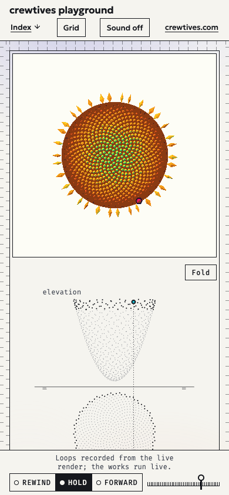

# The museum

The page at `/` of [playground.crewtives.com](https://playground.crewtives.com/) is a museum of the
collection. It is one level above the works: it does not run them, it exhibits them. Each work gets a
**sheet** in the manner of a descriptive-geometry drawing (the design direction is called
"The épure"; the specs and archived changes use its working name, "La épura"): a recorded loop of
the work, the work's whole timeline drawn in plan and elevation, and a title block with data read
from the work itself. One page clock drives every sheet at once, and every sheet links to the live
work.

*The first screen at 1440 × 900, with the clock in HOLD: sheet 004 (Bloomscope). On the left, the
VISTA; on the right, the épure of Sow's seeds, elevation above the ground line and plan below, with
the NOW and its reference line; under it, the title block.*

*The same sheet at 390 × 844. The VISTA fills the width, the épure and the title block follow below
it, and the page clock becomes a fixed bar at the bottom of the screen.*

The behavior is specified in three OpenSpec capabilities. This guide explains how the code meets them;
the specs are the reference:

- [`playground-museum`](../openspec/specs/playground-museum/spec.md): the page, the sheets, the clock,
  the fold and the honesty rules specific to the museum.
- [`work-loops`](../openspec/specs/work-loops/spec.md): how loops are recorded, stored, verified and
  played back, and when a loop counts as stale.
- [`playground-hub`](../openspec/specs/playground-hub/spec.md): what every playground page shares
  (routes, sound, reduced motion, accessibility, demo honesty, budget).

The museum was designed and built in the change archived at
[`openspec/changes/archive/2026-09-28-add-playground-museum/`](../openspec/changes/archive/2026-09-28-add-playground-museum/).
Comments in the museum's code refer to that change's decisions by number (D1 to D16, in its
`design.md`). Terms such as *VISTA*, *épure* and *NOW* are defined in the [glossary](glossary.md).

## Reading a sheet

A work sheet has five parts:

- **The VISTA.** The work's loop, recorded from its live render, inside a passe-partout (called `mat`
  in the code) in the work's own background or frame color, with an ink rule. It is the largest region
  of the sheet.
- **The épure.** The work's *trail*, drawn twice on one drawing: the **elevation** on top, the **plan**
  below, joined by the **ground line**. The complete trail is dotted; the segment the loop covers is
  solid.
- **The NOW.** A dot in the elevation and one in the plan, joined by a reference line perpendicular to
  the ground line. It marks the moment the VISTA is showing: cyan while the clock runs FORWARD, amber
  while it runs REWIND.
- **The title block.** Number and title, the "synthetic" mark on synthetic scenes and, when it
  applies, the stale-loop notice are always visible. Series, form, creation date, technique,
  dimensions with time, pack weight, rule and the loop's provenance line sit in a native `
`
  ("Sheet data"). The main action is a real link, "Enter <title>".
- **The wall text.** At most 80 words, with no figures in it.

Every work épure uses the same axes, and carries the legend "plan: where · elevation: when":

- the **plan** says *where*: on sheets with a 4D pack, the center of the subject over the scene's
  floor; on sheet 004, where each seed was born;
- the **height in the elevation** says *when*: the pack frame, or the seed's birth order;
- plan and elevation share the horizontal axis.

That is the point of the sheet: all the moments of a work at once, with time made into an axis.
Folding the elevation up about the ground line (the fold, see below) turns the drawing into a
space-time curve.

The collection today:

| Sheet | Title | Form | VISTAs (loop ids) | Pack | "Enter" goes to |
|---|---|---|---|---|---|
| 001 | The cat | ○ scene, 4D.OS series | A · Vitrine, B · Plate, C · Leader (`a`, `b`, `c`) | `cat-stairs` | `/4d-os/` |
| 002 | The golden stoop | ○ scene, 4D.OS series | `d` | `falcon-phi` | `/4d-os/d/` |
| 003 | Whale fall | ○ scene, 4D.OS series | `e` | `whale-fall` | `/4d-os/e/` |
| 004 | Bloomscope | □ toy | `bloomscope` (its Sow section) | none | `/bloomscope/` |

Sheet 001 shows one scene in three worlds: three VISTAs, one épure, one NOW. Each of its
passe-partouts takes the color of its world's frame (A's wall, B's plate, C's film leader), because
the loop keeps only the canvas and loses the frame the world draws around it in HTML.

Besides the work sheets the page has:

- **the sheet index**, the second section: one row per work (number, form, a cropped poster, title,
  one-line description, dimensions, date), a rule between rows whose dates differ, an unnumbered
  **gate row** for the 4D.OS series that links to the launcher, a row for sheet 000, and three
  **workshop sheets** with no number, name, date or link;
- **sheet 000, the method**: two timeless figures drawn as épures, Gaudí's double-twist column and the
  tesseract. There the elevation is height, not time, and its text says so;
- **the colophon**: the build stamp, the typefaces and libraries with their licenses, the cat's credit,
  what the page stores, and the references the museum draws on, each with its source.

The page order is: the featured sheet (by default the highest number, so 004 today), the index, the
other work sheets in ascending order, sheet 000 and the colophon. Each sheet is reachable at
`/#sheet-NNN`, and each work links back to its own sheet from its page.

## Where the code lives

| Path | What it does |
|---|---|
| `sites/playground/index.html` | The page shell. The build replaces `<!--museum:body-->` with the sheets and fills `<style id="museum-vistas">`. |
| `sites/playground/vite.config.ts` | The playground's Vite config; it installs the museum plugin. |
| `sites/playground/public/loops/<id>/` | The recorded loops, published at `/loops/<id>/`. |
| `src/playground/museum/collection.ts` | The curation: the only hand-written data about the works. |
| `src/playground/museum/capture.ts` | The recording configuration of each loop. |
| `src/playground/museum/references.ts` | The colophon's references and glossary. |
| `src/playground/museum/build/` | Node-only code that runs at build time: plugin, manifest, static render, épures, axonometries, sheet 000, figure check. |
| `src/playground/museum/loops/` | Pure modules shared by the recording tool, the build, the tests and the browser: the 4DLP format, frame hashes, block sampling and the provenance schema. |
| `src/playground/museum/main.ts` | The page's JavaScript, added on top of the static HTML. |
| `src/playground/museum/clock.ts`, `player.ts` | The page clock and scrubber; the loop player. |
| `src/playground/museum/clockAria.ts` | When and what the scrubber exposes to assistive technology while the clock runs. |
| `src/playground/museum/fold.ts`, `fold3d.ts` | The fold: its state and fallback, loaded on the first fold gesture; and the 3D view, loaded after it only with WebGL2. |
| `src/playground/museum/tokens.css`, `style.css`, `fonts/` | The house tokens (colors, module, 16-color palette), the styles and the two typefaces with their licenses. |
| `tools/capture-loops.ts` | The development-only tool that records the loops. |

## The collection

`src/playground/museum/collection.ts` is where works are chosen and described. It holds, per work
(`WorkSheet`):

- `number`: three digits, never reused (`RETIRED_NUMBERS` lists numbers that lost their sheet), and
  never `000`, which belongs to the method sheet;
- `title`, `line` (the index description), `series`, `form`, `technique`, `enter` (the route of the
  main action) and `text` (the wall text);
- `created`: the creation date, `YYYY-MM-DD`, the day the work was first published in the repository,
  in the author's time zone;
- `rule`: the work's equation or rule, when it has one. Its text is built from constants **imported
  from the work's own module** (for example `SPIRAL` and `SPIRAL_B` from
  `src/pipeline/scenes/falconPhi.ts`), so the museum can never show a rule that differs from the code;
- `pack`: the 4D pack the sheet reads its figures and trail from, or `null`;
- `views`: one per VISTA, with its loop id, its label and link (sheet 001), its passe-partout color as
  a reference to a CSS token of the work (`mat: { file, name }`) and a text description of what the
  loop shows;
- `sources`: the repository paths whose changes make the work's loop stale: its pack, its HTML entry
  and its code, plus the engine and the 4D.OS launcher, which `CORE` adds to every sheet. The loop's
  freshness is computed from them (see
  [Stale loops](#the-sources-hash-and-stale-loops)).

**Why the dates are curated.** Earlier, the build derived each sheet's date from the first commit that
touched the work. That cannot survive a change of history: a new root commit gives every work the same
date, and a shallow clone or a ZIP download has no history at all. The date is now declared once,
here, and the build never runs git.

The file also fixes the Bloomscope garden the loop is recorded with (`FIXED_GARDEN_HASH`, a `#g=`
link written by Bloomscope's own "Copy link to this garden"), the featured sheet (`FEATURED`, `null`
for "the highest number"), the gate row's text (built from the launcher's name and line) and the
collection title, which is the page's only `<h1>`.

`collection.test.ts` checks the curation: three-digit unique numbers, wall texts of 80 words or fewer,
rules that use their module's constants, dates in the right format, every `sources` path and every
passe-partout token exists, the cat credit matches `LICENSES.md`, and the recording configuration in
`capture.ts` agrees with the collection.

## Build time: manifest and static page

The museum is a static document. Everything a reader needs (every sheet, poster, épure, title block,
the index and the colophon) is in the HTML the build writes; JavaScript only adds motion and controls.
A page assembled by JavaScript was rejected because without JavaScript it would be empty. A content
framework was rejected to keep the museum on the same stack as the works.

The flow, in `src/playground/museum/build/`:

1. **`plugin.ts`** (a Vite plugin) runs the generation at `buildStart`, and also when
   `npm run dev:playground` starts, with the same code. It:
   - builds the manifest and renders the page;
   - replaces `<!--museum:body-->` in `index.html` with the body and fills the VISTA CSS;
   - exposes the runtime data as the virtual module `virtual:museum` (its type is checked in at
     `src/playground/museum/virtual.d.ts`, so `tsc --noEmit` does not depend on a generated file);
   - emits the fold's axonometry SVGs as assets (`museum/fold-NNN.svg`);
   - prints each manifest warning as `[museum] …` without failing the build.

   In development it serves the axonometries itself and regenerates the page, with a full reload,
   when a loop is re-recorded or `collection.ts` changes. Other edits, such as a change to a work's
   sources, show up in the manifest after a restart.
2. **`manifest.ts`** reads each work:
   - from the pack's `scene.json` (`sites/4d-os/public/packs/<pack>/`): frame count, fps, duration,
     point counts, the synthetic flag, and the weight (the sum of the file sizes `scene.json`
     declares, written in binary units with the same formatter 4D.OS uses, for example "50.4 MiB");
   - the trail (`trail.ts`, `seeds.ts`, below);
   - each loop's `provenance.json`, validated against the schema in `loops/provenance.ts`;
   - the passe-partout color from the work's tokens (for Bloomscope, the background color the
     recording set behind the canvas, taken from the provenance);
   - the stale state of each loop, from the sources hash.
3. **`render.ts`** turns the manifest into HTML strings, the generated CSS and the runtime data. It is
   made of pure functions, which the tests call directly.

The museum reads the packs from the source tree at build time. The page never requests a pack file
at runtime; what it shows of a work comes from the loops, the posters, the provenance and the data
generated at build time.

### Trails

- **Works with a pack (001 to 003), `trail.ts`.** One moment per pack frame: the centroid of that
  frame's dynamic points, read from `dynamic.bin` with the engine's own parser. The plan uses the
  centroid's position on the floor (x, z); the elevation uses the same x, with the frame number as
  height. The trail comes from the points, never from the equation of the work's rule: the same method
  serves all three packs, it is derived from the data, and it is labeled as what it is ("path of the
  subject's centre").
- **Bloomscope (004), `seeds.ts`.** Sow has no moving center: what changes over time is which seeds
  exist and where each is born. Each seed is a moment. Its plan position is `seedPosition(n, α, c)`,
  the same function Sow places it with, with α read from the fixed garden link and a single scale c
  for the whole trail (that of the flower head in the loop's last frame). Its height is its birth
  order. The seed counts per frame come from the loop's provenance, which read them from the work's
  own readouts. The seeds are drawn as unjoined dots, because consecutive seeds are about 137.5° apart
  and a polyline would cross the whole disc.

In both cases the loop segment and the NOW of every clock position come from the provenance: the
recorded source frames, or the newest seed in each recorded frame.

### Épure and axonometry

`epure.ts` projects a trail into a 480 × 600 viewBox: elevation in the top half, ground line at 300
with its two conventional ticks, plan in the bottom half. The plan has a uniform scale, so the shape
does not depend on the framing. If a pack's path runs mostly in one direction on the floor,
`frontalAngle` turns the vertical plane parallel to it, as descriptive geometry places the vertical
plane parallel to an object's main face, so the elevation shows progress over time. The static SVG
draws the NOW at clock position 0, which is the poster's frame; the runtime receives the NOW of every
position.

`geom3.ts` places what the épure draws into space (x shared, h above the ground line, d in front of
the vertical plane). `axonometry.ts` draws that geometry as the SVG the fold falls back to without
WebGL2, with the NOW of every clock position in a `data-nows` attribute. The 3D fold reads the same
geometry back from the épure in the page, so both fold views show exactly what the épure draws.

`method.ts` draws sheet 000: the double-twist column (a star polygon turned one way and a copy turned
the other; their intersection doubles the points at the end of each segment) and the tesseract,
projected from 4D with the engine's `project4`.

### The figure check

Every visible figure in the museum is rendered through `fig(source, html)`, which wraps it in
`">`. `figures.ts` recomputes each marked figure from its source (`dims:002`,
`weight:001`, `date:004`, `loop:bloomscope`, `stamp`, `ref:<id>` and so on) and reports any mismatch,
any provenance line whose commit is not linked, and any number left in the visible text outside a
mark (proper names with digits, such as 4D.OS or WebGL2, are allowed). The check runs in
`render.test.ts` over the rendered page, so a hand-written figure in a wall text makes `npm test`
fail and names it.

### What fails the build and what only warns

| Situation | Result |
|---|---|
| A work has no recorded loop yet | Warning; the sheet shows "Loop not recorded yet." and, without a pack, no épure |
| A loop's sources hash differs from the current one, or the provenance has none | Warning; the sheet shows "recorded <date>; the work has changed since" |
| A provenance file does not validate | Build fails, listing each problem |
| The loops of sheet 001 do not share their source frames | Build fails |
| The Sow angle in the provenance differs from the fixed garden's | Build fails |
| A `sources` path or a passe-partout token does not exist | Build fails and names it |

Stale loops only warn so that working on a work never blocks the build; the sheet says openly that
the recording is older than the work.

## Runtime

`main.ts` is loaded as a module on top of the finished document. Without JavaScript the page is
already complete: the controls that need JavaScript (the clock, "Play loop", "Fold", "Grid" and the
sound button) ship with `hidden` and are shown only by the script, and "House pixels" is created by
the script when a sheet is folded (`fold.ts`).

### The page clock

`clock.ts` wraps one `TimeController` from the engine (see [engine.md](engine.md)) in a `PageClock`
with three states, FORWARD, REWIND and HOLD. J, K and L set them from anywhere except a text field.
There are no speeds: pressing L again does not speed anything up. Every pass in the collection has 45
frames at 15 fps, so a clock position is simply a frame index, the same for every VISTA. A normalized
phase was rejected, because works of different lengths would then run at different speeds.

When the clock passes the last frame it wraps to the first, and each VISTA and its NOW jump together
in the same painted frame. The cut is declared rather than hidden: the provenance line says how often
the loop restarts. A palindrome was rejected: playing the FORWARD pass backwards while the clock runs
FORWARD would show the work rewinding under a cyan NOW.

The **scrubber** moves every VISTA and every NOW at once. To limit flashes, `ScrubChase` makes the
clock chase the requested position by at most 2 frames per step, one step every 1/15 s, and refuses
to change direction within 1/3 s. A hollow mark shows where the clock is heading. Arrow keys, Home and
End go through the same chase.

A drag on the scrubber never scrolls the page or selects text, with a mouse or a finger: its
`pointerdown` prevents the browser's default (which would start the drag autoscroll) and focuses the
scrubber without scrolling, so the arrows keep working after a drag. Its exposed position
(`aria-valuenow`, and `aria-valuetext` such as "frame 40 of 45, playing forward") follows
`clockAria.ts`: it is written at once on focus and on every state change, at most once a second while
the clock runs and the scrubber does not have focus, and not at all while it runs with focus, so a
screen reader is not read a new frame fifteen times a second.

The animation loop runs only while it has something to do: the clock is not in HOLD, the tab is
visible, and some following VISTA or index preview is on screen.

### A single NOW per sheet

For each sheet, `effectiveFrame` decides the one position that its VISTAs, the NOW of its épure and the
NOW of its fold all show. It is the clock's frame when the sheet follows the clock and all its loops
have arrived; frame 0, the poster's, while any loop is still missing; and, under reduced motion before
the visitor asks to play, the last frame it showed. On sheet 001 the three VISTAs therefore always
show the same source frame.

### Loading on demand

Two `IntersectionObserver`s track each sheet. A sheet less than one viewport height from the screen
requests its FORWARD passes; a sheet on screen is painted. The REWIND passes are requested only after
the visitor first sets the clock to REWIND; until one arrives, the player shows the FORWARD pass in
reverse order. An index row requests its loop only on keyboard focus (`:focus-visible`), or after the pointer has
rested on it for 300 ms, so moving the pointer across the index requests nothing, and a tap or a quick
click on a row follows its link instead of swapping its poster for the loop mid-press.

### The loop player

`player.ts` draws each loop into a 2D canvas at an **integer scale in device pixels**:
`k = floor(dpr × slot width / native width)`, so each loop pixel covers exactly k × k device pixels,
drawn without smoothing. Only when not even k = 1 fits is the loop shown whole, scaled down with
smoothing. That is the single exception, and a non-integer scale without smoothing is never used.

- The canvas is sized in CSS pixels to its buffer and scaled by 1/dpr. At a non-integer dpr, its
  corner is nudged to a whole device pixel after every layout change and scroll, because otherwise the
  browser resamples it even when the size is exact.
- The poster is painted into the same canvas with the same rule as soon as it decodes, so the switch
  from poster to loop changes no pixel and no position.
- The build's generated CSS (`vistaCss` in `render.ts`) sizes the poster before any script runs:
  integer multiples in CSS pixels without JavaScript, and the same device-pixel multiples the player
  will use (for dpr 1, 1.25, 1.5, 2 and 3) with it. Container queries on the VISTA slot pick k.
- Passes are fetched once and shared between a VISTA and its index row. Without
  `DecompressionStream`, or if a download fails, the VISTA stays on its poster with no console error.

### Reduced motion

With `prefers-reduced-motion: reduce`, the clock starts in HOLD and no loop is requested. Each sheet
shows its poster, with its NOW at the poster's frame, and gets a "Play loop" button that makes only
that sheet follow the clock (and starts the clock if it was in HOLD). A gesture on the clock (J, K, L,
the state buttons or the scrubber) counts as a request to play the sheets on screen at that moment, so
no clock control is left dead. Turning reduced motion on while the page is open puts the clock in
HOLD without a reload.

### The fold

Each sheet can be folded: the elevation turns about the ground line from 0°, the flat épure, to 90°,
the dihedron, where the trail stands in space with its projection lines onto both planes. Folding the
vertical plane onto the horizontal one is the operation that defines the épure, so the 3D view teaches
how to read the sheet instead of decorating it.

- **Only the visitor folds.** The "Fold" button, a drag on the ground line (the plane follows the
  drag and, on release, settles at 90° past halfway or returns to flat), or F on the active sheet.
  Nothing folds by scrolling or by itself. Only one sheet is folded at a time; a generation counter in
  `fold.ts` discards a fold that another gesture replaced while its code was loading.
- **Deferred code.** None of the fold's code is part of the initial page. `fold.ts` (state, fallback
  and the "House pixels" selector) is imported on the first fold gesture. The 3D view, `fold3d.ts`,
  with three.js and the engine's `Engine` and `RetroDisplay`, is imported after it, and only when the
  browser has WebGL2.
- **Same display as the works.** The fold is rendered through the same dithered retro display the
  4D.OS worlds use, in 16 colors with the house palette (`--pal-16-*` in `tokens.css`). The "House
  pixels" selector next to an open fold switches only that fold between "1-bit", "16" and "Millions";
  it never touches the loops, which are recordings.
- **Without WebGL2** the fold fetches the build's axonometry SVG for that sheet instead, and moves its
  NOW with the clock from `data-nows`. No 3D code is requested.
- With reduced motion the fold jumps to 90° without animating.

### The rest of the page

- **The light.** A wash of radial patches, lavender at the top and apricot at the bottom, whose
  intensity depends only on the scroll position. The scroll range is measured on load and on resize,
  so the same position always gives the same light, even after a "Sheet data" disclosure makes the
  page longer. Under reduced motion it stays at a fixed intensity at which both colors are visible.
- **The grid.** The house grid shows by default in the margins and in the sheets' rules. G, or the
  "Grid" button on touch screens, shows the full grid with the sheet's column ratio ("13 : 8", from the
  26 : 16 module columns in `render.ts`).
- **Jump by number.** Three digits typed less than 1 s apart go to that sheet, update the URL to
  `#sheet-NNN`, move focus to the sheet and announce its number and title in a live region.
- **Single-key shortcuts** (J, K, L, G, F and the digits) can be turned off from the colophon, as
  WCAG 2.1.4 (character key shortcuts) asks; the choice is kept in `localStorage`.
- **Deep links.** A small inline script in `<head>` hides the page while it is positioned at
  `#sheet-NNN` (for at most 1.5 s), and the end of the body scrolls to the sheet before the first
  paint. After the fonts load, the sheet is put back in place unless the visitor has scrolled.
- **Sound** is off by default. With it on, the museum makes only two synthesized sounds: a hinge
  "clack" when a fold settles and a tick on a jump by number.

### On a phone

The museum's phone rules are in `style.css` and `main.ts`, each under its gate (spec
`phone-ergonomics`); none of them matches on a desktop with a mouse.

- **Portrait, 759 px or less.** The top bar sheds its title row: it is sticky 30 px above the top, so
  only its 45 px navigation row stays (75 px at load). The clock is a fixed bar at the bottom, 79 px
  plus the safe area (`--clock-h`, which also sets the body's bottom padding and
  `scroll-padding-bottom`); the scrubber takes what the states leave (151 px at 390 px). Jumps land
  61 px from the top. The index rows re-flow with the poster under the number (954 px at 390 px).
- **Landscape, at most 500 px tall.** The bar is static in one row, the clock is one 47 px row, each
  VISTA is fitted to the height beside its épure, and sheet 001's three VISTAS sit side by side.
- **Touch (coarse pointer).** Every control keeps its drawn size and gets a 44 px hit area. The ground
  line no longer takes touches, so a swipe over an épure scrolls; the fold is dragged from a grip, a
  14 px square mark at the ground line's right end, created by the script while the gate matches (a
  tap on it folds, like "Fold"). After a fold on a phone the page scrolls the least distance that shows
  the fold view whole, unless the visitor touched or scrolled since pressing Fold.

`tools/check-phone.ts phone museum` checks all of it (the module is `tools/check-phone/museum.ts`).

## Loops

A loop is a short recording of a work's live render, used as the VISTA. The museum does not run the
works: the 4D.OS packs weigh tens of MiB each, and the museum allows itself at most 100 KB of JavaScript
(gzip) before any interaction, with no 3D code. A recording can be exact, small and stopped on any
frame. Every loop is published with a provenance file that says exactly how it was made.

Each loop lives in `sites/playground/public/loops/<id>/` and is published at `/loops/<id>/`:

| File | Content |
|---|---|
| `forward.4dlp.gz` | The FORWARD pass, recorded with the work moving forward. |
| `rewind.4dlp.gz` | The REWIND pass (4D.OS worlds only), recorded with the work rewinding. |
| `poster.webp` | Frame 0 of the FORWARD pass, lossless, at native size. |
| `poster.webp.json` | The poster's provenance sidecar. |
| `provenance.json` | The full record of the recording. |

The two passes of a loop show the same source frame at every position; only the direction in which
the work paints it changes. The REWIND pass exists so that, when the museum rewinds, the work shows its
own rewind signal (such as its NOW in amber) instead of forward frames played backwards. Bloomscope
does not rewind, so it has only a FORWARD pass.

All passes share one cadence, 15 fps and 45 frames (3.0 s), because one clock drives them. Each pass
must weigh at most 1 000 000 bytes as the site transfers it. A work that does not fit changes its
framing, never its cadence or frame count.

### Native resolution: one pixel per block

The works' retro display paints square blocks of device pixels, aligned from the bottom-left corner of
the view. The recording keeps one pixel per block, so a loop frame is the recorded rectangle divided by
the block size: the **native size**. Every pixel is opaque and one of the view's 16 palette colors.
The code is `loops/blocks.ts`: `alignedRect` (a rectangle on the block grid, either whole blocks
`inside` the view, optionally cropped, or the smallest rectangle that `cover`s it), `sampleBlocks`,
`upscale` and `verifyFrame`, which upscales the native frame again and requires 0 differing pixels
against the capture.

### The 4DLP format

`loops/format.ts` defines 4DLP, a deliberately simple container: palette indices at 4 bits per pixel,
whole frames, rows interleaved across frames in `[y][frame][x]` order, with the low nibble holding the
even x. The file is published gzip-compressed. The header is 80 bytes, little-endian, zero-padded:

| Offset | Field |
|---|---|
| 0 | magic `4DLP` |
| 4 | version (u8, currently 1) |
| 5 | bits per pixel (u8, 4) |
| 6 | frames (u16) |
| 8 | width (u16) |
| 10 | height (u16) |
| 12 | fps (u8) |
| 13 | colors (u8, 1 to 16) |
| 14 | bytes per row (u32) |
| 18 | palette: 16 × RGB (48 bytes, unused entries 0) |

Why this format:

- it is **lossless**: decoding a pass gives exactly the recorded frames, which the frame hashes prove;
- any frame can be **drawn in any order**, forward or backward, at the same cost, and the player alone
  decides which frame shows;
- interleaving rows across frames puts the same row of consecutive frames next to each other, which
  gzip compresses better than frame after frame;
- a delta between frames was rejected, because it breaks the regular pattern of the ordered dither and
  compresses worse;
- animated WebP was rejected because not every target browser can decode it frame by frame, and
  seeking in it is expensive; a PNG sprite strip weighed about the same but used far more memory once
  decoded;
- brotli would be smaller, but the site's static-asset hosting compresses a precompressed `.br` file
  again instead of serving it as is, so the file is plain gzip, served as `application/gzip` and
  decompressed in the browser with `DecompressionStream('gzip')`. The player checks the gzip magic
  bytes first, so a server that already decompressed the file also works.

The same module encodes (in the recording tool, in Node) and decodes (in the player, in the browser).
`loops/hash.ts` computes a frame's SHA-256 over its RGBA pixels, row by row from top to bottom, with
WebCrypto, so the recording, the tests and the museum hash frames with the same code.

### Posters

The poster is frame 0 of the FORWARD pass, encoded as lossless WebP by the browser during recording
and decoded again to check that its hash equals frame 0's. The static HTML carries it, so the work is
visible without JavaScript and under reduced motion. Its sidecar, `poster.webp.json`, uses the same
`{ prompt, createdAt }` shape as the repository's other image sidecars. Its text states that the poster
was not generated, which loop and frame it is, the route, the commit, the recording date and the
poster's SHA-256. The recording tool writes it; `posterSidecar` in `loops/provenance.ts` is the
template.

### Provenance

`provenance.json` follows the schema `LoopProvenance` in `loops/provenance.ts`, and
`validateProvenance` checks it both when the tool writes it and when the build reads it. It records:

| Field | What it holds |
|---|---|
| `work`, `loop`, `route` | The sheet and title, whether the scene is synthetic, and the exact route recorded (for Bloomscope, the fixed garden link) |
| `config` | Viewport, dpr, touch emulation, reduced motion, display mode (16 colors), block size, the recorded rectangle in device pixels, every preparation step before frame 0 and, for Bloomscope, the Sow record (section, angle, seeds at the start and at the end, bloom wait, how "Hold to sow" was held) |
| `native`, `palette` | The native size and the palette, 16 colors at most, in the order the format's indices use |
| `format` | 4DLP, version, layout, gzip, content type |
| `recorded` | The recording date, `YYYY-MM-DD` |
| `sources` | `{ algorithm: "sha256", hash }`: the sources hash (below) |
| `commit` | The full hash of the commit the loop was recorded at, for information and for the link |
| `method` | Live render, controlled clock, one pixel per block, verified exact, page elements hidden, how the clock advanced, the tool and its versions, the browser, its version and the renderer |
| `hash`, `poster` | How frame hashes are computed, and the poster's file and hash |
| `passes` | Per pass: direction, fps, frame count, the source frame of each position (pack frames, or controlled-clock instants for Bloomscope), Bloomscope's seed count per frame, the file, its weight, the verification result and one SHA-256 per frame |

The title block turns each provenance into one line of the form "Loop <width> × <height> px ·
<n> colors · 45 frames at 15 fps · loops every 3.0 s · source frames 120–208 · forward and rewind ·
recorded <date> from the live render at commit <sha>" (Bloomscope's has no source frames and says
"forward only"). The line links the full `provenance.json`, and the
7-character commit links that commit in the public repository,
`https://github.com/crewtives/crewtives-playground/commit/<sha>`. On sheet 004 it also links the
recorded garden. Nothing in the line is written by hand, so re-recording a work updates it.

### The sources hash and stale loops

A loop is **stale** when the work changed after it was recorded. The build decides that by content,
not by history. `build/sources.ts` computes a SHA-256 over every file under the sheet's `sources`
paths:

- files are taken in sorted order of their repo-relative paths (with `/` separators);
- files whose name starts with a dot are skipped;
- each file contributes its path, a NUL byte, its length in bytes, a NUL byte, and then its bytes, so
  two different trees cannot produce the same input;
- a `sources` path that does not exist is an error.

The recording tool writes that hash into the provenance. The build recomputes it: if it differs, or
the provenance has none, the build prints a warning with the sheet, the loop, the recording date and
both hashes (abbreviated) and marks the sheet as stale.

**Why a content hash and not a commit.** Comparing the recorded commit with the last commit that
touched the sources needs the full history. It fails on a shallow clone or a ZIP download and flags
every loop after any history rewrite. A content hash gives the same answer from any copy of the tree.

Consequences worth knowing:

- a pure move or rename of a source file changes the hash, because the path is part of the input. That
  is intended: moving the files a work is built from means its loops should be recorded again;
- the engine (`src/engine`), which paints every work, and the 4D.OS launcher (`src/4d-os/launcher`)
  are in every sheet's sources (`CORE` in `collection.ts`). Editing either marks every loop stale;
- the loops folder is not under any sheet's sources, so committing new loops does not make them stale.

### Recording loops

`tools/capture-loops.ts` records one work or the whole collection. It is a development tool: it lives
outside what the build publishes, adds nothing to `package.json`, and writes only inside the loops
folder. What it needs:

- **A git working tree.** The build never runs git, but recording does. The tool refuses to record a
  work whose source paths have uncommitted changes, or that contain files git does not track (they
  would enter the hash on this machine but not in a clone). It records `HEAD` as the commit, so the
  commit always contains exactly what was recorded. Commit your change first, then record, then commit
  the loops.
- **The production build, served.** Recording happens against the real public routes, which the
  development servers do not reproduce (in development 4D.OS is served at `/`, on its own server).
  Build with `rm -rf dist && npm run build && cp deploy/_redirects deploy/.assetsignore dist/`, then
  serve `dist/` with Wrangler in another terminal. The tool's default `--base` is the address that
  the command in its header comment serves, which adds `--port` and `--ip` to
  `npx wrangler dev -c deploy/wrangler.jsonc`. If you start Wrangler without those flags, pass the
  tool `--base` with the URL that Wrangler prints.
- **Pinned Playwright and tsx, through npx.** Run it as
  `npx -y -p playwright@1.63.0 -p tsx@4.23.15 tsx tools/capture-loops.ts <a|b|c|d|e|bloomscope|all>`.
  The tool refuses any other Playwright version, because the browser version is part of what makes a
  recording reproducible. The first time, install its browser with
  `npx -y playwright@1.63.0 install chromium`.
- **A GPU with WebGL2.** Chromium is launched with GPU flags that select ANGLE's Metal backend
  (`BROWSER_ARGS` in the script), so the script as written targets macOS; on another platform, adjust
  those flags. The renderer's name is recorded in the provenance. Two recordings are expected to be
  identical only with the same browser version and the same renderer.

Useful options: `--dry-run` records and verifies but writes nothing, and `--json <file>` dumps the
hashes, seeds, weights, sources hash and sidecar, so a dry run can be compared with the published
loop. `--cpu <n>` throttles the CPU, which must not change a single frame. `--budget`, `--shift`,
`--show`, `--garden` and `--browser-arg` exist to prove each failure mode (a pass over budget, a
misaligned rectangle, page text over the canvas, a different Sow angle, no WebGL2).

**How a work is recorded.** The configuration of each loop is in `src/playground/museum/capture.ts`
(`CAPTURE`), next to the collection it reads sheet, title, pack and sources from:

| Loop | Viewport (CSS px, dpr 1) | Block | Framing | Native size |
|---|---|---|---|---|
| `a` | 1440 × 900 | 3 | the showcase of its first screen | 307 × 172 |
| `b` | 1440 × 900 | 3 | the full plate (zoomed out with 16 presses of "-"), cropped to its clear glass | 389 × 225 |
| `c` | 1680 × 1050 | 3 | the gate window, which needs a wider viewport | 426 × 219 |
| `d` | 1440 × 900 | 3 | the scene without the plotter panel on its right | 300 × 300 |
| `e` | 1440 × 900 | 3 | the observatory | 418 × 231 |
| `bloomscope` | 1440 × 900 | 2 | the square that contains the whole Sow view | 221 × 221 |

The 4D.OS loops cover source frames 120 to 208 of their pack in steps of 2: a 30 fps pack seen at
15 fps advances two pack frames per loop frame, so the loop runs at real speed. A, B and C share that
range, because sheet 001 has one NOW.

For every work the tool:

1. installs Playwright's controlled clock at a fixed date and pauses it before loading the page, so no
   frame depends on wall-clock time, machine speed or paint time;
2. waits for the work to load and applies the preparation steps, which the provenance records;
3. hides every page element except the engine's canvas, with `opacity: 0` rather than `display: none`
   (that would move focus away from "Hold to sow" and stop the sowing);
4. computes the rectangle on the view's block grid and reads the 16-color palette from the view's
   `--pal-16-*` tokens;
5. for a 4D.OS world, advances the clock one 16 ms animation frame at a time until the work's own
   timecode shows the next source frame, checks the work's state readout ("FORWARD +1.00×" or
   "REWIND −1.00×"), captures, and verifies the frame block by block and against the palette. The
   REWIND pass runs a few frames past the range, presses J and captures the same frames on the way
   back;
6. hashes every frame, encodes the passes as 4DLP with gzip, checks the weight budget, decodes them
   again and compares every hash, then encodes and checks the poster;
7. builds and validates the provenance and writes the loop's files into a staging folder that replaces
   the old one in a single rename. If anything fails before that, the previous loop stays untouched.

**Bloomscope is recorded differently**, because its Sow section sows by page time, not through a frame
controller. The tool opens the fixed garden link and fails if the page reports no WebGL2. It parks the
pointer outside the view, focuses "Hold to sow" without scrolling, scrolls Sow into view and waits for
the initial bloom to start. It then runs 12 s of controlled clock, longer than the bloom needs, so the
engine is at rest when sowing starts. For each of the 45 frames it advances the clock by
`Math.round(f·1000/15) − Math.round((f−1)·1000/15)` ms and reads "seeds N" and "divergence …°" from
the work's own readouts, with no hooks added to the work. It fails if the angle differs from the fixed
garden's, or if frame f does not show 610 + 2f seeds. Frame 0 is captured before sowing, and Space is
held down on the focused button right after it. The page background behind the canvas is set to the
palette color Sow paints its own background with. That way the corners outside its circular mask come
out opaque and in the palette, and the square framing keeps the rim of the flower head, where every new
seed is born; no rectangle inside the mask would contain it.

**After recording**, run `npm test` (`loops/published.test.ts` decodes every published pass and checks
each frame against its hash, checks that each poster is a lossless WebP at native size, and that each
sidecar is exactly what the tool would write) and `npm run build`, which must print no `[museum]`
warning. Then commit the loop folders.

## The honesty rules

The museum shows figures about real code, so it holds itself to rules the tests can check:

- **Every figure about a work comes from the work or its curation:** frames, fps, duration, weight,
  the synthetic mark and the trail from its pack; the rule and its constants from its code; the
  creation date from the collection; the loop data from the provenance. There is no hand-written
  figure about a work anywhere in the museum's text.
- **Every other visible figure has a declared source:** sheet numbers from the curation, "demo build
  0.1" from the playground's build stamp, the colophon's years from each cited reference
  (`references.ts`), control labels such as "1-bit" and "16" from the display modes, and the number of
  4D.OS worlds from the launcher's list.
- **The check is automatic.** The figure check fails on any figure without a source or that does not
  match it (see [The figure check](#the-figure-check)).
- **The page says what it is.** Next to the clock, "Loops recorded from the live render; the works run
  live."; "synthetic" on every sheet of a synthetic scene, without opening anything; "the work has
  changed since" on a stale loop. What the colophon says the page keeps (only the sound and
  keyboard-shortcut preferences, in the browser) is exactly what it keeps.
- **Credits stay next to the images.** The cat's CC-BY credit, exactly as `LICENSES.md` sets it,
  appears wherever the cat is shown: one line under sheet 001's three VISTAs, next to its row in the
  sheet index, and in the colophon.

## Changing the museum

- **Edit a wall text, title or line.** Change `collection.ts`. Keep wall texts to 80 words and free of
  figures; `npm test` checks both. The loops stay fresh, because the collection is not a work's source.
- **Change a work.** The next build warns that its loop is stale and the sheet says so. Commit the
  change, record the loop again, run the tests and the build, and commit the loop.
- **Add a work.** Give it the next unused number in `SHEETS`, with its `created` date, `sources`,
  `views` and passe-partout tokens. Add its loop id to `LOOP_IDS` and `passesFor` in
  `loops/provenance.ts` and to the `LoopId` type in `collection.ts`, add its recording configuration
  to `CAPTURE` in `capture.ts`, and record it. The manifest knows two kinds of trail today, pack
  centroids and Sow's seeds, so a new toy without a pack also needs a trail of its own in
  `manifest.ts`.
- **Build only the museum.** `PLAYGROUND_ONLY=museum` compiles just that page of the playground, for
  example to measure its load budget in isolation.

The museum's tests live next to the code, in `src/playground/museum/**/*.test.ts`: the collection,
the manifest (including stale loops over temporary folders), the rendered page against its specs, the
figure check, the trails, sheet 000's geometry, the clock and scrubber, the 4DLP format, block
sampling, the provenance schema, the published loops, the house tokens' contrast and the font audit.
